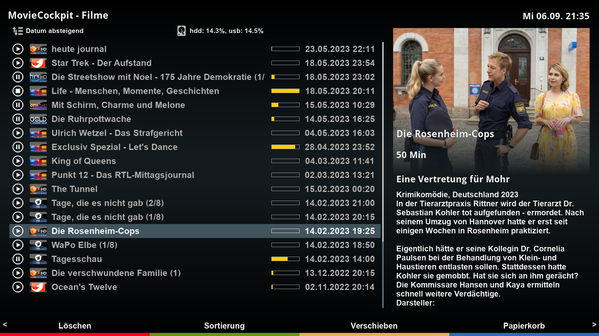
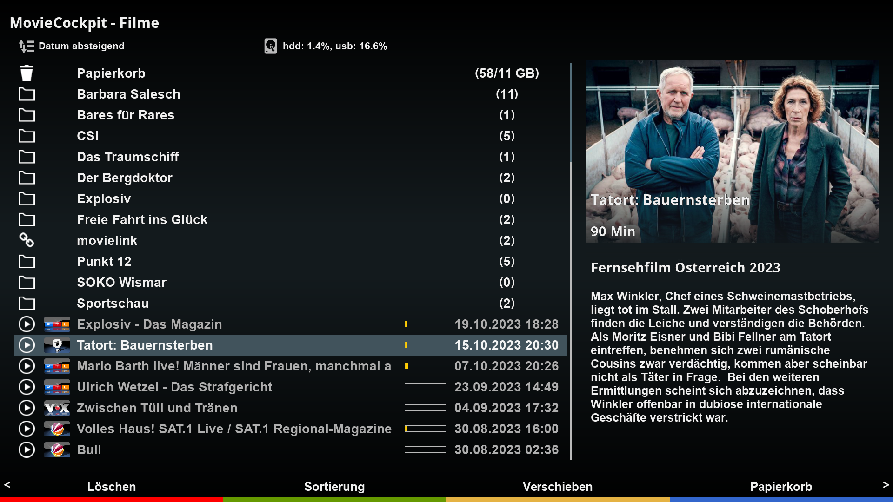

[](https://gemfury.com/f/partner)

# MovieCockpit (MVC)





## Features
- MVC is a movie list plugin for DreamOS settop boxes.
- MVC implements a permanent sqlite movie cache which allows MVC to display the movie list with all its information without disk access. So, no spinners or delays due to disk spinup.
- MVC imports all movies located in the E2 movie directories, which can be located on multiple physical disks.
- MVC implements exact event start time and duration rather than recording start time and duration which includes margins before and after the event as implemented in the standard DreamOS.
- MVC provides various options to configure the skin to your liking.
- MVC provides a smart jump function that conventiently allows to skip advertisements using the bouquet keys by adapting the skip distance automatically.
- MVC provides a manual/automatic backup function that allows to record movies to an internal disk and then move it to external backup media (USB/NAS).
- MVC uses the plugin MountCockpit that dynamically recognizes and mounts network drives powering on/off.
- MVC supports various sources for "video artwork" especially tailored to tv recordings.
- MVC supports individual covers for movies ```<movie filename>.jpg``` and common covers for all movies in a directory ```<directory>.jpg```.
- MVC supports series folders: recordings will be added to the appropriate folder automagically.
- MVC supports unique sorting by folders.
- MVC supports HD, FHD, and WQHD skin resolutions.

## Limitations
- MVC supports DreamOS only.
- MVC is being tested on DM 920 and DM ONE only.

## Languages
- english
- german
- italian (by Spaeleus)

## Links
- Installation: https://dream-alpha.github.io/MovieCockpit
- Support: https://github.com/dream-alpha/MovieCockpit/discussions
